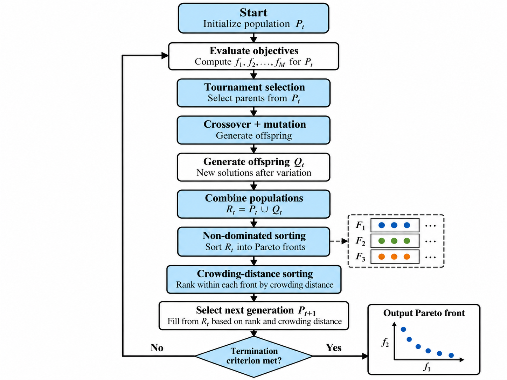
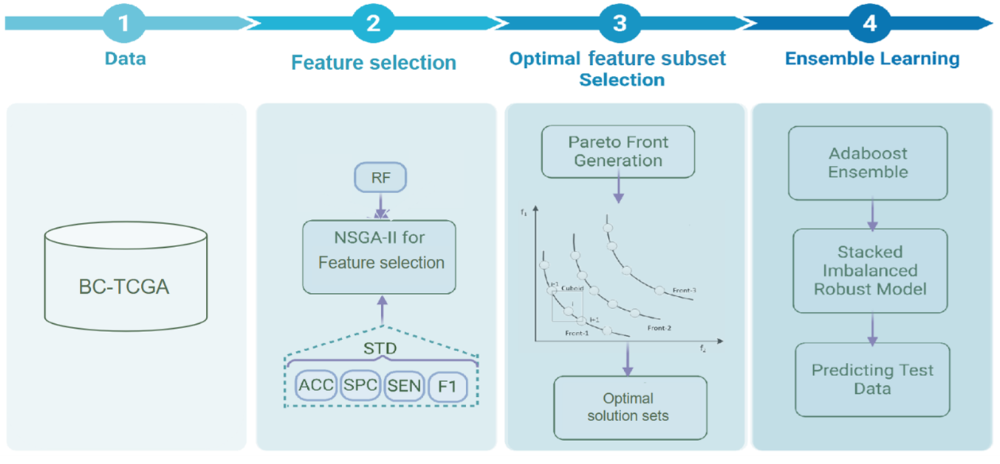
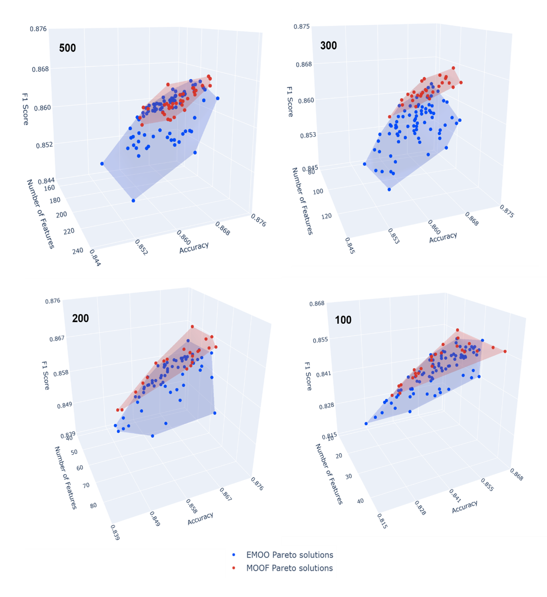

# EMOO-FS

### Adapting Ensemble Multi-Objective Optimisation for Omics Feature Selection

The original EMOO framework was developed for hyperparameter optimisation by Moradpour et al. (2026) [1]. In this project, I adapted the framework for feature selection.

In EMOO-FS, candidate solutions are represented as binary feature masks, where selected genes are encoded as 1 and excluded genes as 0. NSGA-II is used to search for feature subsets that optimise multiple objectives simultaneously: accuracy, specificity, sensitivity, F1-score, metric stability, and the number of selected features. The resulting subsets are evaluated using a Random Forest classifier.

> The source code for this project is maintained in a private repository. This public repository presents the methodology, experimental design, results, and selected visualisations.

---

## Motivation

Omics datasets often contain far more features than samples. In gene-expression data, thousands of genes may be measured for a comparatively small number of patients, creating a high-dimensional feature-selection problem.

Many features may be redundant or provide little predictive information, while retaining too many features can increase computational cost, overfitting, and difficulty in biological interpretation. Feature selection is therefore particularly important in omics-based machine learning.

Multi-objective optimisation provides a way to consider several competing objectives simultaneously. Rather than optimising only one metric, methods such as NSGA-II can search for solutions that balance predictive performance and feature-subset size.

NSGA-II produces a set of non-dominated solutions known as the **Pareto front**, where each solution represents a different trade-off between the optimisation objectives.

---

## Aim

The aim of this project was to adapt the existing EMOO framework from hyperparameter optimisation to feature selection and evaluate its performance against baseline feature-selection methods and the single-solution multi-objective approach MOOF.

The project also examined:

- whether using all Pareto-optimal solutions improves performance
- whether selecting only the top-ranked Pareto solutions is more effective
- whether different ensemble strategies influence classification performance
- how different pre-filter sizes affect performance and selected feature subsets

---

## Dataset

The project used the **TCGA Breast Cancer (TCGA-BRCA)** gene-expression dataset.

The dataset contained:

- **20,531 genes**
- **1,069 patients**
- **494 Luminal A samples**
- **575 samples from other breast-cancer subtypes**

The classification task was to distinguish **Luminal A** from other molecular subtypes.

This dataset represents a typical high-dimensional omics setting, where the number of features is much larger than the number of samples.

---

## Methodology

Because direct evolutionary search over more than 20,000 genes was infeasible, a pre-filtering step was applied before multi-objective feature selection.

The dataset was split into 80% training and 20% test data. All preprocessing and feature-selection steps were fitted only on the training set to prevent data leakage.

Preprocessing included:

- CPM normalisation
- log₂(CPM + 1) transformation
- variance filtering
- Welch’s t-test
- Benjamini-Hochberg FDR correction
- mutual-information ranking

Four candidate feature spaces were evaluated:

- Top 500 genes
- Top 300 genes
- Top 200 genes
- Top 100 genes

Each candidate solution was encoded as a binary feature mask. A Random Forest classifier was then trained and evaluated using only the selected genes.

### Optimisation objectives

**Maximised**
- Accuracy
- Specificity
- Sensitivity
- F1-score

**Minimised**
- Standard deviation across classification metrics
- Number of selected features

---

## Workflow

---

## Methods Compared

To evaluate EMOO-FS, I compared it with two baseline feature-selection methods and a single-solution multi-objective approach.

| Method | Type | Selection strategy |
|---|---|---|
| **t-test top-k** | Statistical baseline | Selects half of the pre-filtered genes using the smallest FDR-adjusted p-values |
| **RFECV-RF** | Model-based baseline | Recursive feature elimination with cross-validation |
| **MOOF** | Multi-objective, single solution | NSGA-II followed by TOPSIS |
| **EMOO-FS** | Multi-objective ensemble | NSGA-II followed by ensemble learning |

MOOF uses a similar multi-objective optimisation approach to EMOO-FS, but reduces the Pareto front to a single final solution using TOPSIS. EMOO-FS instead combines Pareto-optimal solutions through ensemble learning.

---

## Experimental Setup

Feature subsets were optimised using NSGA-II with:

- **100 generations**
- **Population size:** 50
- **Crossover probability:** 0.95
- **Mutation probability:** 0.05
- **Cross-validation:** Repeated Stratified 5-fold × 3
- **Base classifier:** Random Forest
- **Evaluation:** 5 random seeds

Due to the computational cost of the evolutionary search, the experiments were run on the Lise High-Performance Computing (HPC) system.

---

## Results

### Feature-selection performance

I compared EMOO-FS with RFECV-RF, t-test top-k, and MOOF across the different pre-filter sizes.

For the top-500 feature space, EMOO-FS using the original AdaBoost-based ensemble strategy achieved the lowest average rank across the evaluated criteria (1.40). It achieved the highest accuracy, sensitivity, and F1-score while selecting substantially fewer genes than RFECV-RF.

| Criterion | RFECV-RF | t-test top-k | MOOF | EMOO-FS (AdaBoost) |
|:---:|:---:|:---:|:---:|:---:|
| Accuracy | 85.42&nbsp;±&nbsp;1.79% | 84.86&nbsp;±&nbsp;2.13% | 85.14&nbsp;±&nbsp;2.55% | **85.51&nbsp;±&nbsp;2.27%** |
| Specificity | 85.59&nbsp;±&nbsp;1.80% | **88.01&nbsp;±&nbsp;2.85%** | 85.21&nbsp;±&nbsp;2.55% | 85.73&nbsp;±&nbsp;2.41% |
| Sensitivity | 85.42&nbsp;±&nbsp;1.79% | 82.10&nbsp;±&nbsp;2.79% | 85.14&nbsp;±&nbsp;2.55% | **85.51&nbsp;±&nbsp;2.27%** |
| F1-score | 85.43&nbsp;±&nbsp;1.79% | 84.26&nbsp;±&nbsp;2.30% | 85.15&nbsp;±&nbsp;2.54% | **85.53&nbsp;±&nbsp;2.26%** |
| Selected features | 320.0&nbsp;±&nbsp;147.3 | 250 | **172.0&nbsp;±&nbsp;12.0** | 186.7&nbsp;±&nbsp;8.1 |
| Mean rank | 2.60 | 3.20 | 2.80 | **1.40** |

RFECV-RF produced comparable predictive performance, but selected an average of 320 genes compared with approximately 187 genes for EMOO-FS. This shows how including the number of selected features as an optimisation objective can favour more compact feature subsets while maintaining competitive predictive performance.

### Pareto-front analysis

The Pareto fronts show the trade-offs between accuracy, F1-score, and the number of selected features across the four pre-filter sizes.

Across all pre-filter sizes, EMOO-FS produced a wider Pareto front with greater diversity of feature subsets, whereas MOOF produced a more compact distribution.

As the pre-filter size decreased from 500 to 100 genes, the Pareto fronts gradually became smaller. A larger candidate feature space provided NSGA-II with a wider range of possible feature combinations, resulting in a broader set of Pareto-optimal solutions.

### Ensemble experiments

I also evaluated whether using the complete Pareto front was always the most effective strategy.

For the **top-500 setting**, using only the top three Pareto solutions with AdaBoost-based stacking achieved **86.54 ± 2.07% accuracy**, compared with **85.51 ± 2.27%** when using the complete Pareto front.

I then compared the original AdaBoost-based stacking strategy with soft voting. For the top-500 setting using the complete Pareto front:

| Metric | AdaBoost | Soft voting |
|---|---:|---:|
| Accuracy | 85.51 ± 2.27% | **86.54 ± 1.96%** |
| Specificity | 85.73 ± 2.41% | **86.76 ± 1.97%** |
| Sensitivity | 85.51 ± 2.27% | **86.54 ± 1.96%** |
| F1-score | 85.53 ± 2.26% | **86.55 ± 1.96%** |

Across the evaluated seed–pre-filter combinations, soft voting achieved higher mean performance for all four classification metrics.

These results suggest that both the number of Pareto solutions and the ensemble strategy can influence the performance of EMOO-FS.

---

## Key Takeaways

- EMOO was successfully adapted from hyperparameter optimisation to omics feature selection.
- EMOO-FS achieved competitive predictive performance while selecting substantially fewer genes than RFECV-RF in the top-500 setting.
- EMOO-FS produced a broader range of Pareto-optimal feature subsets than MOOF.
- Using the complete Pareto front was not always optimal; smaller ensembles performed better for some larger feature spaces.
- Soft voting performed better than AdaBoost-based stacking across the evaluated seed–pre-filter combinations.
- The results showed that an ensemble strategy effective for hyperparameter optimisation does not necessarily transfer directly to feature selection.
- A key strength of EMOO is its flexibility: the framework is not restricted to a specific classifier, search space, or ensemble strategy, making it adaptable to different optimisation problems.

## Project Context

This project was developed as part of my M.Sc. Computational Biology and Bioinformatics work in Medical Informatics at the University Medical Center Göttingen (UMG).

---

## Tech Stack

`Python` · `scikit-learn` · `NSGA-II` · `Random Forest` · `Multi-objective Optimisation` · `Feature Selection` · `Ensemble Learning` · `TCGA-BRCA` · `HPC` · `Plotly`

---

## Interactive Visualisations

Interactive 3D Pareto-front comparisons between EMOO-FS and MOOF are available for each pre-filter size:

- [Top 500 genes](interactive/S1_Pareto_EMOO_vs_MOOF_top500.html)
- [Top 300 genes](interactive/S2_Pareto_EMOO_vs_MOOF_top300.html)
- [Top 200 genes](interactive/S3_Pareto_EMOO_vs_MOOF_top200.html)
- [Top 100 genes](interactive/S4_Pareto_EMOO_vs_MOOF_top100.html)

---

## Reference

[1] Moradpour, M., Ritter, Z., & Hauschild, A.-C. (2026).  
*Ensemble multi-objective hyperparameter optimization for the classification of imbalanced heart disease data*.  
Expert Systems with Applications, 301, 130318.  
https://doi.org/10.1016/j.eswa.2025.130318
